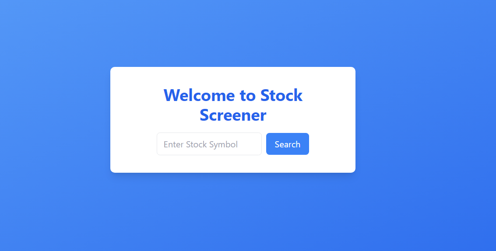

# Stock Screener

Stock Screener is a Flask web application that allows users to screen stock data including current market information and historical data. Users can enter a stock symbol, and the application fetches and displays the stock's details along with a historical chart.

## Installation

To run the Stock Screener application locally, follow these steps:

1. Clone this repository to your local machine:

`git clone https://github.com/aggelospaschos/stock_screener.git`

2. Navigate to the project directory:

`cd .../.../stock_screener`

3. Create a virtual environment using Conda (assuming Conda is installed):

`conda create --name stock_screener python=3.8`

4. Activate the virtual environment:

`conda activate stock_screener`

5. Install the required Python packages:

`pip install -r requirements.txt`

## Usage

Once the project and dependencies are installed, you can run the Stock Screener application locally. Ensure you are in the project directory and the virtual environment is activated.

Run the Flask application using the following command:

`python app.py`

This will start the Flask development server, and you can access the application in your web browser at `http://localhost:5000`.

## Screenshots

